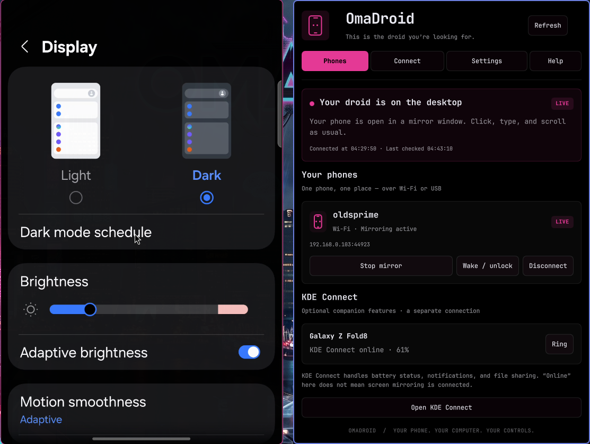

# OmaDroid

**This is the droid you’re looking for.**

An Omarchy bar plugin for mirroring and controlling Android phones with your computer's mouse and keyboard. Uses scrcpy for the display and optional KDE Connect for battery status and Ring. Notifications and file sharing remain available through KDE Connect.

No root, paid service, Samsung account, or additional Android mirroring app is required. This is an independent community plugin, not an official Omarchy, KDE, Samsung, or scrcpy product.



[More screenshots](docs/screenshots.md) · [Release v0.3.3](https://github.com/onelegdave/omadroid/releases/tag/v0.3.3) · [Security and privacy](SECURITY.md)

## Install

On an Omarchy desktop with the Quickshell plugin system:

```bash
omarchy plugin add https://github.com/onelegdave/omadroid --enable
```

Open the phone icon in the bar and follow **Connect → Desktop → Phone → Pair → Ready**. OmaDroid offers explicit Install buttons for missing desktop tools. Android debugging authorization is required; KDE Connect alone cannot mirror the phone.

The command installs the current upstream branch. For the numbered release, download and extract `omadroid-v0.3.3.tar.gz` from [Releases](https://github.com/onelegdave/omadroid/releases/tag/v0.3.3), review its source, and use the local installer below. Checksums are included with the release.

## Requirements

- Omarchy with its Quickshell plugin system (`omarchy plugin --help`). Older Waybar-based versions are not supported.
- Desktop: Python 3, scrcpy 3 or newer, android-tools (ADB), systemd's busctl (included in Omarchy). If ADB was built without mDNS, automatic discovery uses `avahi-browse` from the optional `avahi` package and a running Avahi daemon. Manual IP entry works without discovery.
- The default **Keep phone awake while mirroring** option requires scrcpy's `--keep-active` feature (verified with scrcpy 4.1). Older scrcpy versions can be used with this option disabled; the plugin reports how to resolve an unsupported option before launch.
- Android 5+ for USB mirroring; Android 11+ for wireless pairing without a cable and for audio forwarding.
- Optional KDE Connect on both the computer and phone. The KDE Plasma desktop is not required.

## Install from an extracted release or local checkout

```bash
/usr/bin/python3 -E -s install.py
omarchy restart shell
```

Open the phone icon in the bar, then **Connect → Desktop**. Choose **Install required tools** if prompted. The app opens a terminal that shows the packages and requests your desktop password if needed. Return to OmaDroid when it finishes; status refreshes automatically. **Help → Desktop tools** also offers optional KDE Connect, wireless discovery, and USB access rules. Discovery installation enables the Avahi service. No package is installed just by opening the panel.

The installer validates file ownership/types and the manifest ID, backs up shell.json and any previous installation, installs the fixed file list into `~/.config/omarchy/plugins/onelegdave.omadroid`, and adds the bar entry if needed. Existing settings and bar placement are preserved. It respects XDG_CONFIG_HOME and does not edit packaged Omarchy files. It launches no commands and downloads nothing; run the shell restart separately to load the update. Installation runs as your desktop user. Backups are under `~/.config/omarchy/plugin-backups` and `shell.json.bak-omadroid-*`.

If an upgrade still displays the previous interface after installation, run `omarchy restart shell`. Some shell versions retain cached QML components through a plugin rescan. Existing mirror sessions remain open. The plugin ID and command target are `onelegdave.omadroid`.

### Upgrade from the former plugin ID

For versions through 0.3.2, use the local installer from the new release once. It migrates the former plugin ID to `onelegdave.omadroid` while preserving bar placement and options, backs up the old installation and shell configuration, and disables the old copy. Restart the shell after installation. Saved phone connections and pairing remain available. If both IDs are already configured, the installer refuses to guess which settings to keep.

## Connect your phone

Click the phone icon, then **Connect**. The four-step guide covers **Desktop → Phone → Pair → Ready**. Use **Help** at any time for expandable instructions and troubleshooting. **Phones** shows your connections; **Settings** controls the next mirror session.

### Wi-Fi, Android 11 or newer

1. Connect the computer and phone to the same local network. Enable Android Developer options (usually tap Build number seven times; some vendors put this under Software information).
2. Enable **Wireless debugging**. Choose **Pair device with pairing code**.
3. Enter that dialog's IP address, pairing port and six-digit code in **Pair**. A detected pairing address can be selected instead. Leave the dialog open until pairing finishes.
4. The plugin automatically connects to the connection service advertised by that phone, including when ADB lacks native discovery. If necessary, return to the main **Wireless debugging** screen. If discovery is unavailable, enter its IP address and connection port under **Ready → Manual connection**. **The pairing port and connection port are different.**
5. Click **Mirror** beside the ready device.

ADB remembers authorization. The plugin remembers successfully used connection addresses. Addresses and ports can change: use current discovery or the address shown by the phone. Discovery uses ADB's mDNS and may be blocked by guest Wi-Fi, client isolation, VPN routing or a firewall. Manual addresses are supported, including `[IPv6]:port`. Wireless debugging may need to be enabled again after a reboot or network change. The plugin does not enable unauthenticated legacy TCP debugging or open firewall ports.

The status card shows whether a mirror is active or a connection is ready, with the latest check age and connection-change time. Each identified phone has one ready/live card, with a summary of its Wi-Fi and USB connections. The custom Android name takes priority over the model name. KDE Connect has its own clearly labeled online/offline status. Disconnected remembered phones remain visible with a Connect button. Nearby phones have a Connect button directly in the mirroring list.

Remembered phones reconnect automatically when discovery advertises the same identity, even if the address or port changed. Android versions advertising a serial number use that stable identity; older advertisements use the service name and may require manual reconnection if it changes. Automatic retries are limited to once per address every 30 seconds and can be disabled in **Settings**. After successful pairing, discovery can complete connection to the same host for up to ten minutes. The plugin never automatically pairs unknown phones or starts a mirror session without clicking Mirror.

### USB, including older Android versions

Enable **USB debugging**, connect a data-capable cable, unlock the phone and allow debugging from the computer. Click Mirror when it appears. If the plugin reports USB permissions are missing, choose **Help → Desktop tools → Install USB rules**, reconnect, and follow your distribution's device access guidance.

### KDE Connect

Pair using KDE Connect on the computer and phone. This is separate from mirroring authorization. Phone and tablet entries appear with reachability and battery information when available. Use **Ring** to find a connected phone, or **Open KDE Connect** for its other features. Device lists are kept separate because KDE Connect and ADB have different identifiers; the plugin does not guess which phone should receive input.

## Using the mirror

- Mouse clicks, scrolling and keyboard input go to the mirrored phone. scrcpy's normal shortcuts apply; see its official documentation.
- Click **Stop mirror** beside the phone to close its mirror windows, or close an individual mirror window to end that session. The phone stays connected so you can open Mirror again. Closing the OmaDroid panel does not stop mirroring.
- **Disconnect** closes that phone’s Wi-Fi mirrors and connections, including IPv4 and IPv6, and pauses automatic reconnection until you manually choose **Connect** again. USB stays available until you unplug its cable.
- Disconnect does not erase pairing. To forget this computer, remove it in the phone’s Wireless debugging settings.
- Multiple phones can be mirrored. Connections reporting the same Android hardware identity share one phone card; the active mirror is preferred, then a ready USB connection. Matching model names or nicknames alone never merges devices. If Android refuses identity queries and discovery cannot identify it, an unresolved connection stays separate. Confirmed connection identities are remembered so offline phone cards also stay grouped. Stop and Disconnect recheck connected device identities before acting.
- **Settings** sets quality (Balanced, Sharp, Low bandwidth), audio forwarding, and whether the physical phone display is turned off. Changes apply to the next session.
- **Keep phone awake while mirroring** is enabled by default. It prevents idle sleep for the duration of the mirror session, including Wi-Fi sessions on battery with the physical screen off. It uses scrcpy's `--keep-active`; it does not change the phone's saved screen timeout or remove its lock credentials. Normal idle behavior resumes after the mirror closes. Turn the option off if you want ordinary idle sleep during a session.
- If the phone is already asleep or locked, use **Wake / unlock** beside it in the panel. This sends Android's wake command and asks Android to show its normal unlock prompt. Enter the PIN or use your normal unlock method when required. It does not submit credentials or bypass a secure lock. Older Android versions that lack the unlock-prompt command can still be woken, then unlocked normally.
- In the mirror window, right-click wakes a sleeping phone; left Alt+P presses its power button, and left Alt+M invokes the menu/unlock-screen shortcut. See the [scrcpy shortcuts](https://github.com/Genymobile/scrcpy/blob/master/doc/shortcuts.md). `--stay-awake` alone only works while the phone is plugged in, which is why the plugin uses `--keep-active` instead. See [scrcpy's device controls](https://github.com/Genymobile/scrcpy/blob/master/doc/device.md).
- Foldables use scrcpy's handling of display size and rotation; actual fold/unfold behavior needs validation on the specific handset.
- Android lock screens and capture-protected apps still enforce their restrictions. Some vendors require an additional security/debugging setting to allow input. Audio capture depends on the Android version and app.

## Theme integration

OmaDroid follows Omarchy’s live palette and popup surface colors. Status accents, errors, button contrast, font family, named font sizes, spacing, control fills, and corner rounding derive from the shell’s `Color` and `Style` settings. It has no separate color scheme or theme selector. Theme changes take effect through Omarchy’s normal theme application, including light themes and user overrides.

## Troubleshooting and privacy

OmaDroid has no telemetry, advertising, cloud relay, automatic update check, or crash upload. Runtime phone endpoints are restricted to private local-network addresses; public Internet endpoints and remote ADB-server overrides are not supported. Package downloads happen only after you choose an Install button. The OneLegDave credit in Help opens the author's website in your browser only when clicked; it adds no tracking parameters or phone data. Automatic clipboard sharing is disabled; left Alt+V explicitly pastes the computer clipboard into the phone. See [SECURITY.md](SECURITY.md) for the command/network inventory, review fixes, and audit limits.

The panel shows pairing/connection failures and USB authorization states. Later scrcpy failures generate a desktop notification. Per-session logs are under `~/.cache/phone-mirror`; saved connection addresses and confirmed device/connection identities are under `~/.local/state/phone-mirror` (both respect XDG overrides). New files are private to your user. Pairing codes are passed through standard input, cleared from the panel, and never saved or included in process command lines. Mirroring does not record video to disk.

ADB authorization gives this computer debugging access to your phone; revoke it in Developer options when you no longer trust the computer. Disabling this plugin does not revoke ADB or KDE Connect pairing.

```bash
omarchy-shell onelegdave.omadroid open
omarchy-shell onelegdave.omadroid setup
omarchy-shell onelegdave.omadroid help
omarchy-shell onelegdave.omadroid settings
omarchy-shell onelegdave.omadroid status
omarchy plugin disable onelegdave.omadroid
```

To remove: disable the plugin, close any mirror windows, then use `omarchy plugin remove onelegdave.omadroid`. Local logs and recent addresses can be removed separately. To revoke wireless authorization, forget this computer in the phone's Wireless debugging settings.

## Development

```bash
python3 -m unittest discover -s tests -v
omarchy plugin validate .
bash lint-qml.sh
```

`phone_mirror.py status` returns JSON, including reconnect candidates; it does not connect to them itself. The panel submits a connect action when automatic reconnection is enabled. `phone_mirror.py action` reads one JSON request from stdin. Operations validate addresses and select devices explicitly; no user-controlled text is evaluated by a shell. ADB uses its standard local server and authorization store. Status checks run every 10 seconds while open and every 30 seconds while closed. During setup, checks briefly speed up to every 3 seconds for up to two minutes after entering or advancing the guide, pairing, or connecting. Opening the panel, completing an action, or clicking Refresh checks immediately. The status line shows a fixed last-check time instead of a ticking counter. OmaDroid does not install a background system service. The optional discovery Install button enables the distro Avahi service explicitly.

Built and tested initially against Omarchy's installed Quickshell API, scrcpy 4.1 and android-tools 37.0.0. Android end-to-end compatibility requires physical-device testing; see VALIDATION.md for the current evidence.

Upstream documentation: [scrcpy](https://github.com/Genymobile/scrcpy), [Android wireless debugging](https://developer.android.com/tools/adb#wireless-android11-command-line), [KDE Connect](https://kdeconnect.kde.org/).

## License

Created and maintained by [OneLegDave](https://www.onelegdave.dev/).

MIT, copyright OneLegDave. Dependencies retain their own licenses.
