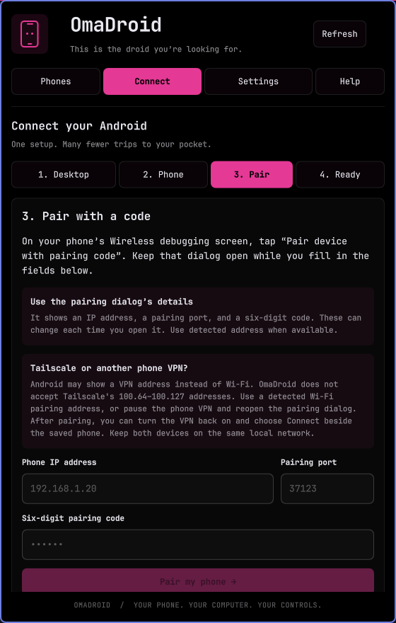
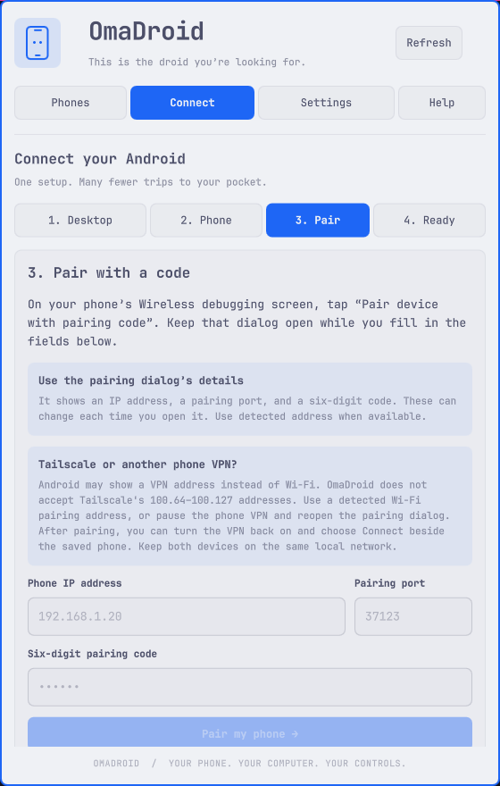
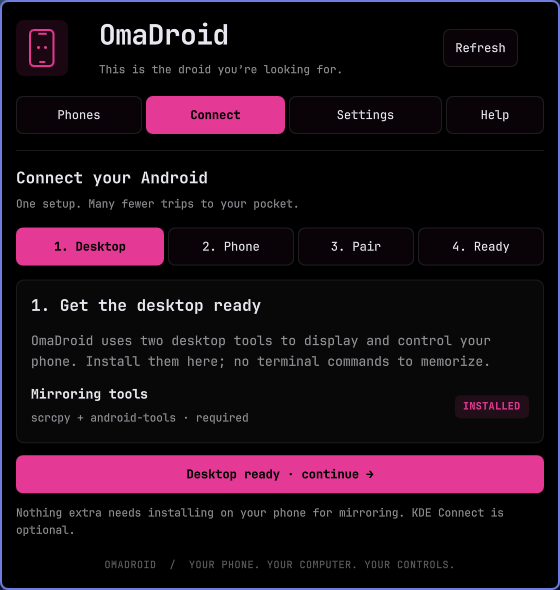
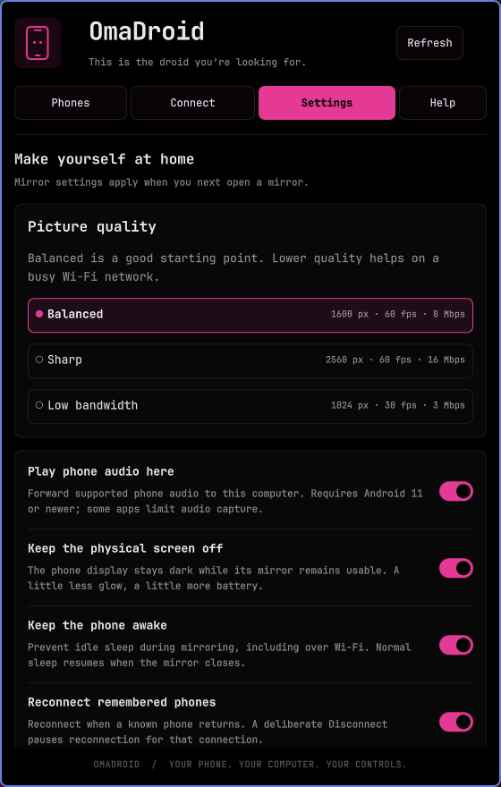
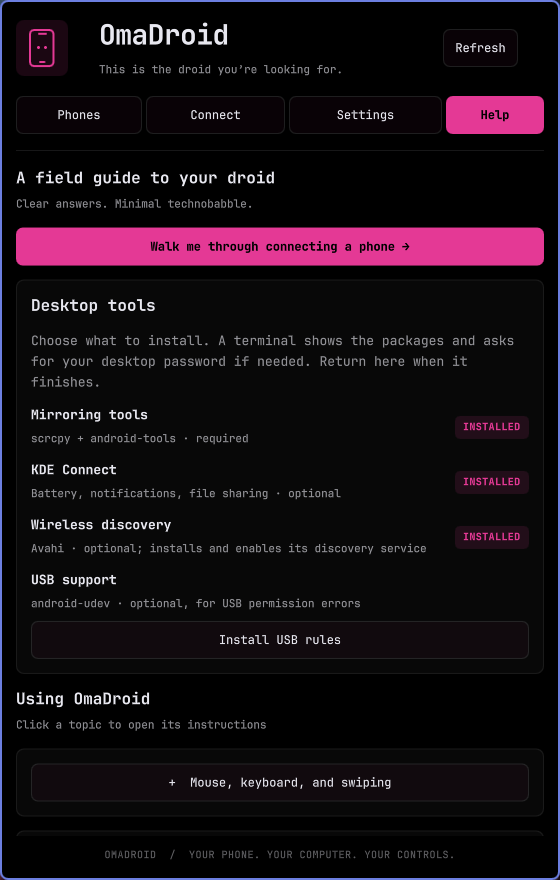

# OmaDroid screenshots

Real captures of OmaDroid running in Omarchy Shell. The original gallery shows 0.3.1; the VPN pairing guidance below shows 0.3.4. The plugin uses the installed Omarchy palette, fonts, and corner settings. Long pages scroll.

## Pairing with Tailscale or another phone VPN — 0.3.4

The pairing page now explains Wi-Fi address selection and reconnecting after the VPN is enabled again. These live captures were checked in the active dark theme and a temporary Catppuccin Latte palette; the user's original palette was restored. The empty fields show placeholders, not phone addresses or pairing codes.

## Live mirroring — marketplace preview

The root `preview.png` is the marketplace image. It shows the real scrcpy mirror and the matching LIVE phone card, with Stop mirror, Wake / unlock, Disconnect, and optional KDE Connect status visible. Android's Display settings page keeps personal app content out of the capture. The phone status bar was temporarily hidden for the screenshot and its prior display policy was restored immediately afterward. The local phone address is redacted in the final marketplace image. No simulated phone data or generated UI is used.

## Guided connection

## Mirror settings

## Help and dependency installation

[Back to installation and features](../README.md)
