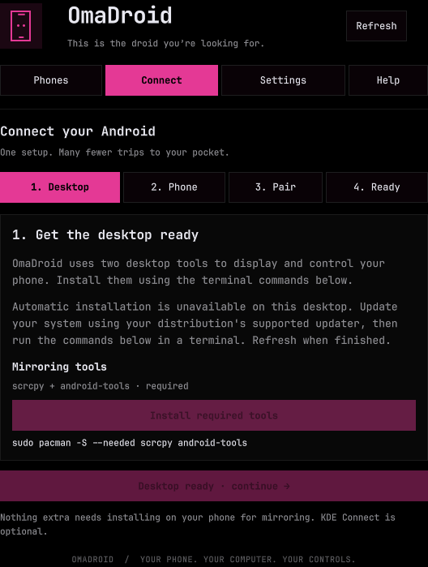
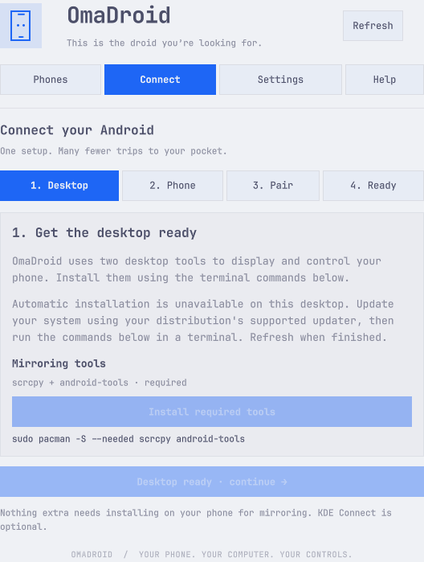
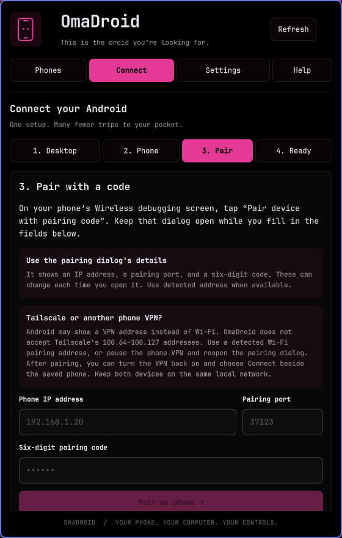
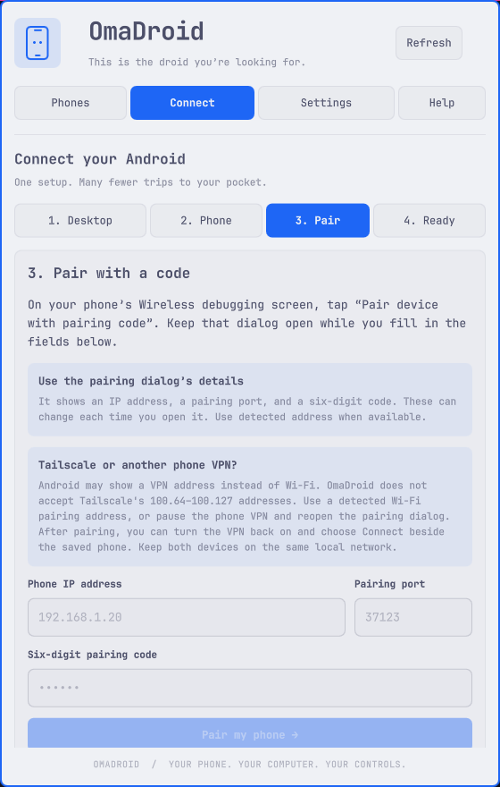
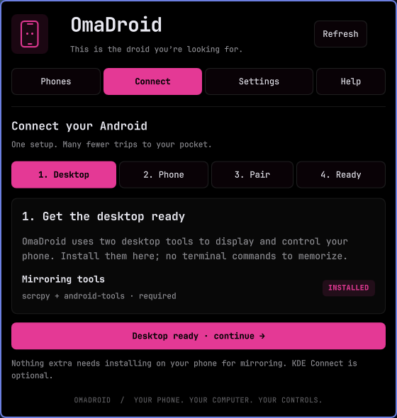
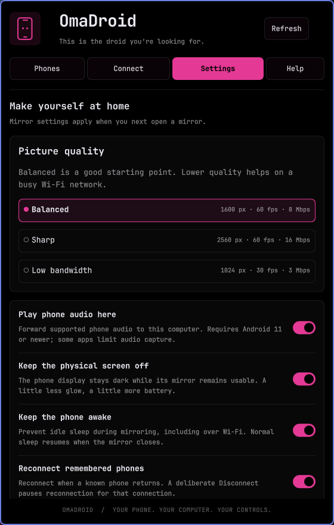
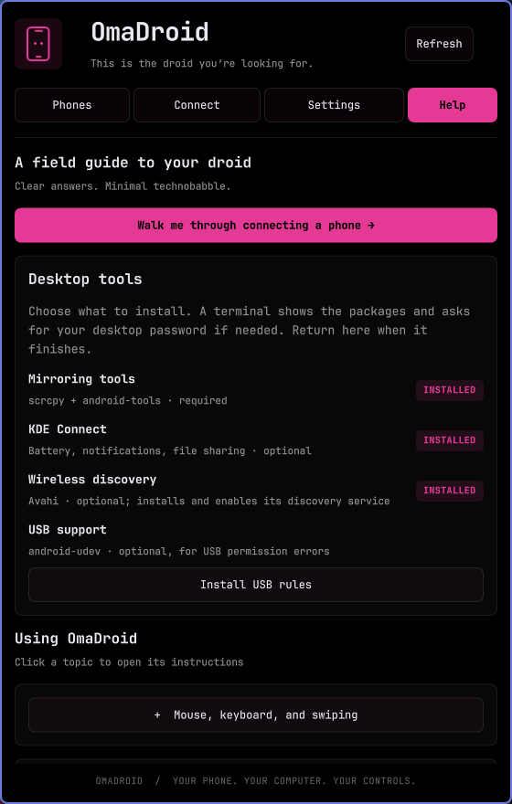

# OmaDroid screenshots

Version 0.3.7 retains the existing preview and gallery: the destination-resolution fix changes no screen layout. The captures retain their original version provenance below.

Captures of the actual OmaDroid interface. The 0.3.6 setup captures use an isolated Quickshell instance with synthetic dependency status; the older gallery was captured in Omarchy Shell. The original gallery shows 0.3.1; the VPN pairing guidance below shows 0.3.4. The plugin uses the installed Omarchy palette, fonts, and corner settings. Long pages scroll.

## Manual desktop setup — 0.3.6 marketplace preview

The root `preview.png` shows Desktop setup when the installation launcher is unavailable. These dark and light captures render the actual QML in an isolated Quickshell instance using synthetic status with no phones and missing desktop tools. They contain no account data, device identifiers, or credentials. The installed plugin and desktop settings were not changed. These captures verify the fallback interface; they do not demonstrate a physical-phone session or OmarchyMac compatibility.

## Pairing with Tailscale or another phone VPN — 0.3.4

The pairing page now explains Wi-Fi address selection and reconnecting after the VPN is enabled again. These live captures were checked in the active dark theme and a temporary Catppuccin Latte palette; the user's original palette was restored. The empty fields show placeholders, not phone addresses or pairing codes.

## Guided connection

## Mirror settings

## Help and dependency installation

[Back to installation and features](../README.md)
